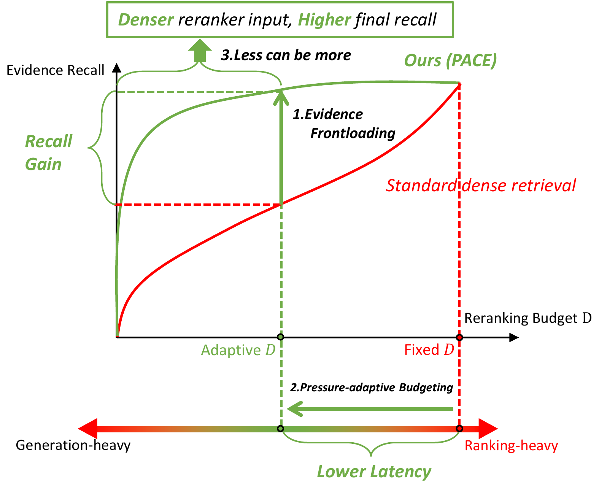
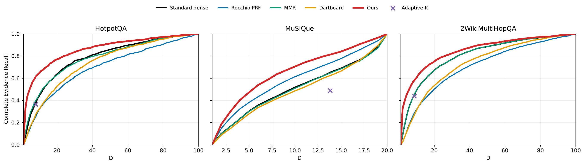
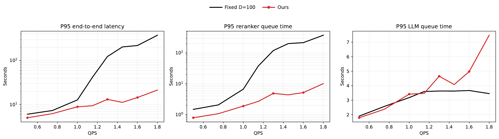
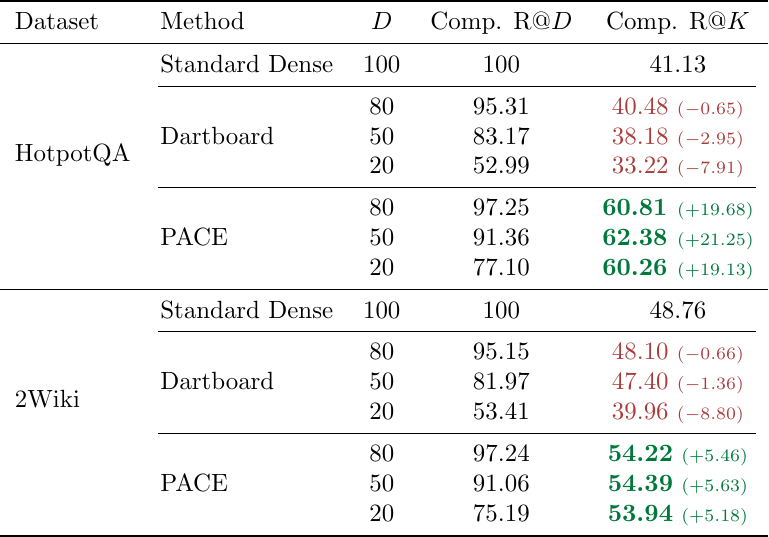

# PACE-RAG: Less can be More

**PACE** (*Prioritized Adaptive Coverage of Evidence*) improves RAG efficiency and effectiveness by combining **evidence frontloading** with **pressure-adaptive evidence budgeting**.

## Contents

- [PACE-RAG: Less can be More](#pace-rag-less-can-be-more)
  - [Contents](#contents)
  - [The problem](#the-problem)
  - [Core ideas](#core-ideas)
  - [Results](#results)
    - [🔴 1. Evidence Frontloading](#-1-evidence-frontloading)
    - [🔵 2. Pressure-Adaptive Evidence Budgeting](#-2-pressure-adaptive-evidence-budgeting)
    - [🟠 3. Less can be More](#-3-less-can-be-more)
  - [Quick Run](#quick-run)
    - [Evidence frontloading only](#evidence-frontloading-only)
    - [Full experiments](#full-experiments)
  - [Full Reproduction Guide](#full-reproduction-guide)
    - [Installation](#installation)
    - [Data Layout](#data-layout)
      - [Building the BERGEN corpus and SPLADE index](#building-the-bergen-corpus-and-splade-index)
    - [Reproduction Workflow](#reproduction-workflow)
      - [Preprocessing](#preprocessing)
        - [External prerequisites](#external-prerequisites)
        - [HotpotQA](#hotpotqa)
        - [2WikiMultiHopQA](#2wikimultihopqa)
        - [MuSiQue](#musique)
      - [Effectiveness experiments](#effectiveness-experiments)
      - [Online serving simulation](#online-serving-simulation)
    - [Environment variables](#environment-variables)

## The problem

RAG systems often retrieve many documents and then rerank them before generation. Under high request rates, or large reranking budgets, scoring all candidates can make the **reranker the system bottleneck**, increasing queueing delay and end-to-end latency. Simply reranking fewer documents is faster, but may discard supporting evidence.


> **Goal:** reduce reranking work while preserving useful evidence.

## Core ideas

<p align="center">
  <a href="docs/intro_figure_v3.pdf">
    
  </a>
</p>

1. **Evidence frontloading.** PACE moves useful documents earlier in the ranking prefix, enabling high recall with a smaller reranking budget.
2. **Pressure-adaptive evidence budgeting.** PACE compares reranker and LLM queue pressure, then dynamically adjusts how many documents are sent to the reranker.
3. **Less can be more.** By combining evidence frontloading with adaptive budgeting, PACE can rerank **fewer** documents while achieving **lower** latency and **higher** final recall.


## Results

### 🔴 1. Evidence Frontloading

> **Result summary:** higher recall at fixed $D$.

<p align="center">
  <a href="docs/complete_evidence_recall_vs_d.pdf">
    
  </a>
</p>

### 🔵 2. Pressure-Adaptive Evidence Budgeting

> **Result summary:** lower reranker pressure and lower latency.

<p align="center">
  <a href="docs/hotpot_online_latency_p95.pdf">
    
  </a>
</p>

### 🟠 3. Less can be More

> **Key observation:** **fewer reranked documents can lead to both lower latency and higher Recall@K ($K=5$).**

<p align="center">
  <a href="docs/less_more.pdf">
    
  </a>
</p>

---

## Quick Run

### Evidence frontloading only

Evidence frontloading can be used independently of the serving system, datasets, and caches. Given `N` candidate documents represented in the same dimension of `d`, call:

```bash
python -m pip install -e .
```

```python
import numpy as np

from pace.methods import frontload_evidence

documents = ["document A", "document B", "document C"]

order = frontload_evidence(
    query_features=np.array([1.0, 1.0]),                # [d]
    document_features=np.array([                       # [N, d]
        [1.0, 0.0],
        [0.0, 1.0],
        [1.0, 1.0],
    ]),
    query_relevance=np.array([0.9, 0.8, 0.2]),         # [N]
    document_similarity=np.array([                     # [N, N]
        [1.0, 0.1, 0.3],
        [0.1, 1.0, 0.4],
        [0.3, 0.4, 1.0],
    ]),
    budget=2,
)

selected_documents = [documents[index] for index in order]
print(order)               # [2, 0]
print(selected_documents)  # ['document C', 'document A']
```

| Input                 | Shape    | Meaning                                 |
| :-------------------- | :------- | :-------------------------------------- |
| `query_features`      | `[d]`    | Query features, such as SPLADE features |
| `document_features`   | `[N, d]` | Candidate features in the same space    |
| `query_relevance`     | `[N]`    | Retriever or reranker relevance scores  |
| `document_similarity` | `[N, N]` | Pairwise candidate similarities         |
| `budget`              | scalar   | Number of documents to return           |

The output is a list of `budget` distinct indices into the original candidate list, ordered by evidence-frontloading priority.

### Full experiments

1. Install PACE-RAG and its dependencies:

```bash
python -m pip install -r requirements.txt
```

2. Download and extract the prepared-data package (**download link: data will be provided later**) next to the repository:

```text
workspace/
├── PACE-RAG/
└── data/
```

The scripts use `../data` by default. For a different location, set `PACE_DATA_ROOT=/absolute/path/to/data`.

3. Reproduce the effectiveness results without regenerating caches:

```bash
# Figure 3,4,5
PREPARE_CACHE=0 bash scripts/run_hotpot.sh
PREPARE_CACHE=0 bash scripts/run_2wiki.sh
PREPARE_CACHE=0 bash scripts/run_musique.sh
# Table 2
bash scripts/run_joint_d_to_k.sh
MPLCONFIGDIR=/tmp/pace-matplotlib python -m pace.evaluation.plot_effectiveness \
    --input-root outputs/effectiveness \
    --output-root outputs/effectiveness
```

To reproduce the HotpotQA online-serving results after the HotpotQA effectiveness run, use three CUDA-capable GPUs:

```bash
# Figure 6,7,8
bash scripts/run_online_hotpot.sh
bash scripts/plot_online_hotpot.sh
```

---

## Full Reproduction Guide

### Installation

PACE-RAG requires Python 3.10 or newer. Install the project with model and cohort-reconstruction dependencies:

```bash
python -m pip install -r requirements.txt
```

For development and tests, also install the test extra:

```bash
python -m pip install -e ".[models,cohort,test]"
```

Online serving simulation requires three CUDA-capable GPUs. Effectiveness evaluation can use either CUDA or CPU. 

### Data Layout

Large datasets, generated cohorts, and model caches are stored outside this repository. Their root directory is configured using `PACE_DATA_ROOT`.

The recommended prepared-data package is approximately 0.87 GB and contains everything required to run the effectiveness and online-serving experiments without rebuilding retrieval or loading preprocessing models:

```text
data/
├── hotpotqa/
│   └── top100_complete/
│       ├── cohort/
│       │   └── batches/
│       ├── cache/
│       │   ├── coverage_features/
│       │   ├── reranker_scores/
│       │   └── splade_similarity/
│       └── workloads/
│           └── heldout_1087/
├── 2wikimultihopqa/
│   └── top100_complete/
│       ├── cohort/
│       │   └── batches/
│       └── cache/
│           ├── coverage_features/
│           ├── reranker_scores/
│           └── splade_similarity/
└── musique/
    ├── musique_ans_v1.0_dev.jsonl
    └── cache/
        ├── coverage_features/
        ├── reranker_scores.npy
        └── splade_similarity/
```
The following smaller inputs are additionally required only when rebuilding the prepared cohorts from retrieval results:

```text
data/
├── hotpotqa/
│   ├── hotpot_dev_distractor_v1.json
│   └── eval_dev_out.json
└── 2wikimultihopqa/
    ├── dev.json
    └── top100_complete/
        └── corpus_coverage/
            ├── report.json
            └── dense_top100.part*.npz
```

The complete reconstruction path also requires the external BERGEN artifacts below, which total approximately 261 GB and are not included in the prepared-data package:

```text
BERGEN_CORPUS_DIR/
├── dataset_info.json
├── state.json
└── data-*.arrow

BERGEN_INDEX_DIR/
└── embedding_chunk_*.pt
```

`BERGEN_CORPUS_DIR` contains the BERGEN-segmented Wikipedia passages, while `BERGEN_INDEX_DIR` contains the corresponding SPLADE-v3 passage embeddings in exactly the same corpus order.

#### Building the BERGEN corpus and SPLADE index

These two artifacts were generated by [BERGEN](https://github.com/naver/bergen), rather than by this repository. Install BERGEN following its official instructions, then run the following command from the BERGEN repository root:

```bash
python bergen.py \
    dataset=wiki_cntx_granularities/hotpotqa_castorini_6-3 \
    retriever=splade-v3
```

When the artifacts do not already exist, BERGEN downloads the `wiki-all-6-3-tamber` configuration of `castorini/odqa-wiki-corpora`, converts every passage to `"{title}: {text}"`, and saves the processed Hugging Face dataset under:

```text
datasets/odqa-wiki-corpora-all-63-tamber_train/
```

BERGEN then encodes the passages with `naver/splade-v3` using a maximum input length of 128 and stores the sparse tensors under:

```text
indexes/odqa-wiki-corpora-all-63-tamber_doc_naver_splade-v3/
```

Set `BERGEN_CORPUS_DIR` and `BERGEN_INDEX_DIR` to these two directories. Do not reorder corpus rows or embedding chunks: retrieval assumes that every embedding row has the same global index as its corresponding corpus passage. In our environment, the processed corpus and index occupy approximately 44 GB and 218 GB, respectively.


### Reproduction Workflow

There are two supported starting points. The recommended path uses prepared cohorts and caches to reproduce the paper results. The complete path rebuilds them from the original datasets, the preprocessed BERGEN Wikipedia corpus, and the SPLADE index.


The official QA datasets, BERGEN corpus segmentation, corpus embeddings, pretrained retrieval model, reranker, and compressor ([Provence](https://huggingface.co/naver/provence-reranker-debertav3-v1)) are external resources. This project performs retrieval, evidence alignment, cohort filtering, calibration splitting, and cache generation.

#### Preprocessing

The preprocessing pipeline has six steps:

1. **Prepare candidates.** For HotpotQA and 2WikiMultiHopQA, retrieve the Top-100 BERGEN passages with SPLADE-v3. MuSiQue instead uses the candidate paragraphs supplied with its answerable dev split.
2. **Align gold evidence.** Match each dataset's annotated supporting facts to sentences in the candidate passages. Each candidate receives a `covered_facts` field recording exactly which gold facts (e.g., evidence) it contains.
3. **Build the evidence-labelled cohort.** Store each question, its gold facts, candidate passages, retrieval scores, and evidence-alignment results in one common schema.
4. **Filter retrieval failures.** For HotpotQA and 2WikiMultiHopQA, retain only questions whose Top-100 candidates collectively contain every gold supporting fact. This isolates evidence ordering from first-stage retrieval failure. MuSiQue already provides a closed candidate set and does not use this filter.
5. **Split calibration from evaluation.** Select 100 query IDs deterministically using SHA-256 ordering, use them only to calibrate baseline hyperparameters, and exclude them from all reported metrics. The remaining queries form the evaluation set.
6. **Generate reusable caches.** Precompute reranker scores, SPLADE coverage features, and query-document/document-document similarities used by the effectiveness and online-serving experiments.

##### External prerequisites

The complete preprocessing pipeline requires the official dev splits of HotpotQA, 2WikiMultiHopQA, and MuSiQue-Ans, together with the BERGEN Wikipedia corpus and its corresponding SPLADE index.

```bash
export PACE_DATA_ROOT=/path/to/data
export BERGEN_CORPUS_DIR=/path/to/bergen_corpus
export BERGEN_INDEX_DIR=/path/to/bergen_splade_index
```

##### HotpotQA

The HotpotQA preprocessing flow is:

```text
official dev data
→ select the 5,600-query Provence evaluation subset
→ retrieve 100 BERGEN passages per query with SPLADE-v3
→ match gold supporting facts to candidate sentences
→ retain the 1,187 queries with all gold facts in Top-100
→ reserve 100 calibration queries and evaluate on the remaining 1,087
→ generate reusable caches
```

Retrieve all 5,600 candidate queries in batches of 100:

```bash
for batch_index in $(seq 0 55); do
    pace-retrieve hotpot \
        --evaluation "${PACE_DATA_ROOT}/hotpotqa/eval_dev_out.json" \
        --labels "${PACE_DATA_ROOT}/hotpotqa/hotpot_dev_distractor_v1.json" \
        --index-dir "${BERGEN_INDEX_DIR}" \
        --output-dir "${PACE_DATA_ROOT}/hotpotqa/top100_complete/cohort/batches" \
        --batch-index "${batch_index}" \
        --batch-size 100 \
        --seed 2026 \
        --candidate-count 100 \
        --device cuda
done
```

Align retrieved passages with gold supporting facts and materialize the cohort; the evaluation loader later retains queries with complete evidence in Top-100:

```bash
pace-materialize-cohort \
    --dataset hotpot \
    --labels "${PACE_DATA_ROOT}/hotpotqa/hotpot_dev_distractor_v1.json" \
    --evaluation "${PACE_DATA_ROOT}/hotpotqa/eval_dev_out.json" \
    --retrieval-dir "${PACE_DATA_ROOT}/hotpotqa/top100_complete/cohort/batches" \
    --corpus-dir "${BERGEN_CORPUS_DIR}" \
    --output-dir "${PACE_DATA_ROOT}/hotpotqa/top100_complete/cohort" \
    --batch-size 100 \
    --seed 2026
```

Generate the reusable caches:

```bash
scripts/prepare_cache.sh \
    hotpot \
    "${PACE_DATA_ROOT}/hotpotqa/top100_complete/cohort" \
    "${PACE_DATA_ROOT}/hotpotqa/top100_complete/cache" \
    cuda
```

##### 2WikiMultiHopQA

The 2WikiMultiHopQA preprocessing flow is:


```text
official dev split
→ identify queries whose gold evidence exists in the BERGEN corpus
→ retrieve 100 BERGEN passages per query with SPLADE-v3
→ match gold supporting facts to candidate sentences
→ retain the 2,961 queries with all gold facts in Top-100
→ reserve 100 calibration queries and evaluate on the remaining 2,861
→ generate reusable caches
```

First identify queries whose gold evidence can be resolved in the BERGEN corpus:

```bash
pace-audit-2wiki-corpus \
    --labels "${PACE_DATA_ROOT}/2wikimultihopqa/dev.json" \
    --corpus-dir "${BERGEN_CORPUS_DIR}" \
    --output "${PACE_DATA_ROOT}/2wikimultihopqa/top100_complete/corpus_coverage/report.json"
```

Retrieve the corpus-complete queries in eight parts:

```bash
for part_index in $(seq 0 7); do
    pace-retrieve 2wiki \
        --labels "${PACE_DATA_ROOT}/2wikimultihopqa/dev.json" \
        --coverage-report "${PACE_DATA_ROOT}/2wikimultihopqa/top100_complete/corpus_coverage/report.json" \
        --index-dir "${BERGEN_INDEX_DIR}" \
        --output-dir "${PACE_DATA_ROOT}/2wikimultihopqa/top100_complete/corpus_coverage" \
        --part-index "${part_index}" \
        --num-parts 8 \
        --candidate-count 100 \
        --device cuda
done
```

Compute Top-100 evidence coverage and materialize the final cohort:

```bash
pace-materialize-cohort \
    --dataset 2wiki \
    --labels "${PACE_DATA_ROOT}/2wikimultihopqa/dev.json" \
    --retrieval-dir "${PACE_DATA_ROOT}/2wikimultihopqa/top100_complete/corpus_coverage" \
    --corpus-coverage-report "${PACE_DATA_ROOT}/2wikimultihopqa/top100_complete/corpus_coverage/report.json" \
    --corpus-dir "${BERGEN_CORPUS_DIR}" \
    --output-dir "${PACE_DATA_ROOT}/2wikimultihopqa/top100_complete/cohort" \
    --num-parts 8
```

Generate the reusable caches:

```bash
scripts/prepare_cache.sh \
    2wiki \
    "${PACE_DATA_ROOT}/2wikimultihopqa/top100_complete/cohort" \
    "${PACE_DATA_ROOT}/2wikimultihopqa/top100_complete/cache" \
    cuda
```

##### MuSiQue

MuSiQue uses the official answerable dev split and its provided closed-context candidate paragraphs, so it does not use the BERGEN corpus, external retrieval, or additional passage segmentation.

```text
official answerable development split
→ use the supplied candidate paragraphs and supporting-paragraph labels
→ convert them to the common evidence-labelled schema
→ reserve 100 calibration queries and evaluate on the remaining 2,317
→ generate reusable caches
```

```bash
scripts/prepare_cache.sh \
    musique \
    "${PACE_DATA_ROOT}/musique/musique_ans_v1.0_dev.jsonl" \
    "${PACE_DATA_ROOT}/musique/cache" \
    cuda
```

The deterministic 100-query calibration split is selected when the effectiveness evaluation is first run, and calibration queries are excluded from the reported evaluation results.

#### Effectiveness experiments

With the prepared data package, run the three datasets without regenerating caches:

```bash
# Figure 3, 4, 5
PREPARE_CACHE=0 bash scripts/run_hotpot.sh
PREPARE_CACHE=0 bash scripts/run_2wiki.sh
PREPARE_CACHE=0 bash scripts/run_musique.sh
# Table 2. Less can be More
bash scripts/run_joint_d_to_k.sh 
```

Generate the cross-dataset D-stage and ablation figures:

```bash
MPLCONFIGDIR=/tmp/pace-matplotlib python -m pace.evaluation.plot_effectiveness \
    --input-root outputs/effectiveness \
    --output-root outputs/effectiveness
```

The main outputs are `joint_d_to_k/joint_recall.csv`, the two PDFs under `cross_dataset_D/`, and `cross_dataset_ablation/complete_evidence_recall_ablation.pdf`. All experiments use fixed batch sizes of 8 reranker pairs, 10 LLM requests, and 4 Provence inputs.

#### Online serving simulation

The HotpotQA online experiment uses the fixed 1,087-query evaluation cohort and requires three GPUs: one each for the reranker, LLM, and Provence compressor.

```bash
bash scripts/run_online_hotpot.sh
```

The experiment evaluates nine methods at QPS values from 0.5 to 1.8, with a 60-second warm-up, adaptive \(D \in [20,100]\), \(K=5\), and at most 128 generated tokens. Raw request traces, summaries, and the run manifest are written to `${PACE_ONLINE_OUTPUT_ROOT}/hotpot`. Completed method-QPS combinations are skipped when the command is resumed.

Generate the Figures 6,7, and 8 after the serving run completes:

```bash
bash scripts/plot_online_hotpot.sh
```

The PDFs are written to `${PACE_ONLINE_OUTPUT_ROOT}/hotpot/paper_plots`.

### Environment variables

Copy the example configuration:

```bash
cp .env.example .env
```

Edit the paths, then load it:

```bash
set -a
source .env
set +a
```

If unset, `PACE_DATA_ROOT` defaults to `../data`, `PACE_OUTPUT_ROOT` to `outputs/effectiveness`, and `PACE_ONLINE_OUTPUT_ROOT` to `outputs/online`, all relative to this repository.

Generated experiment results are written to `outputs/` and are not tracked by Git.
